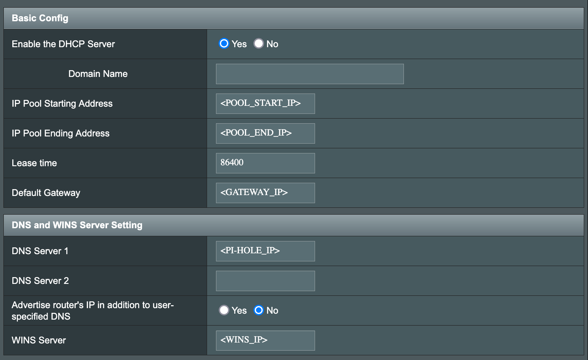
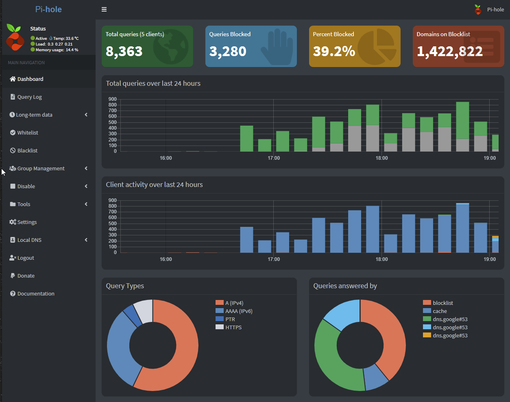

# Pi-hole Ad-blocking Solution with Docker and Raspberry Pik

I set up a network-wide ad blocker using Pi-hole on a Raspberry Pi, running in a Docker container. This project integrates with my ASUS mesh router to route DNS traffic, block ads, and improve DNS performance across all devices on the network.

## Features

- Network-wide ad blocking for all devices.
- Pi-hole runs inside a Docker container for portability and easier updates.
- Integration with ASUS mesh router for seamless DNS traffic management.
- Environment variables managed via `.env` file for flexibility.

## Setting Up the Environment Variables

This project uses a `.env` file to manage configuration. Follow these steps to set it up:

1. **Create the `.env` File**:
   Copy the example environment variables file:
   ```bash
   cp .env.example .env
   ```

2. **Edit the `.env` File**:
   Open the `.env` file and configure the following variables:
   ```plaintext
   # Timezone for the Pi-hole container
   TZ=America/Chicago

   # Admin interface password
   WEBPASSWORD=your_password_here

   # Static IP for the Pi-hole container
   PIHOLE_IP=192.168.1.2

   # Subnet configuration for the Docker network
   SUBNET=192.168.1.0/24
   ```

3. **Ensure Security**:
   The `.env` file contains sensitive information and should not be shared or committed to version co$

## Installation Guide

### 1. Flash Raspberry Pi OS (Lite) onto the SD Card

**Download and Install Raspberry Pi Imager**
Get the imager from [raspberrypi.org](https://www.raspberrypi.org/software/).

**Select OS and Storage**
- Choose **Raspberry Pi OS Lite** as the operating system.
- Select your SD card as the storage device.

**Customize Settings**
- Click the gear icon to open advanced settings.
  - Set **hostname**: `<HOSTNAME>`.
  - Enable **SSH** with public-key authentication and paste your public SSH key.
  - Set a username (e.g., `user`) and password.
  - Set the **time zone** to your location and **keyboard layout** to `US`.

**Flash the Image**
- Click **Write** to flash the OS to the SD card.   
- Safely eject the SD card and insert it into the Raspberry Pi.
     
### 2. Boot the Raspberry Pi

**Power On**
- Connect the Raspberry Pi to power and ensure it’s connected to your network via Ethernet.
  
**SSH into the Raspberry Pi**
- Open a terminal on your computer and run:
  ```bash
  ssh user@<HOSTNAME>
  ```

### 3. Update the Raspberry Pi
  
**Update System Packages**
- Run the following command:
  ```bash
  sudo apt update && sudo apt upgrade -y
  ```
  
### 4. Install Docker
  
**Download and Install Docker**
- Run the following commands:
  ```bash
  curl -fsSL https://get.docker.com -o get-docker.sh
  sudo sh get-docker.sh
  ```

**Verify Docker Installation**
- Check Docker’s status:
  ```bash
  sudo systemctl status docker
  ```
  
### 5. Set Up Pi-hole
     
**Create Configuration Directories**
- Set up directories to store Pi-hole configuration data:
  ```bash
  mkdir -p ~/pihole/etc-pihole
  mkdir -p ~/pihole/etc-dnsmasq.d
  ```
  
**Install Docker Compose**
- Run the following command:
  ```bash
  sudo apt install -y docker-compose
  ```

**Create a Docker Compose File**
- Navigate to the Pi-hole directory:
  ```bash
  cd ~/pihole
  ```

- Create and edit the `docker-compose.yml` file:
  ```bash
  nano docker-compose.yml
  ```
  
Add the following content (already references the `.env` variables):
     
```yaml
version: "3"
  
services:
  pihole:
    container_name: pihole
    image: pihole/pihole:latest
    environment:
      TZ: '${TZ}'                # Use timezone from .env
      WEBPASSWORD: '${WEBPASSWORD}' # Use admin password from .env
    volumes:
      - './etc-pihole:/etc/pihole'
      - './etc-dnsmasq.d:/etc/dnsmasq.d'
    ports:
      - '53:53/tcp'
      - '53:53/udp'
      - '80:80/tcp'
    restart: unless-stopped
    cap_add:
      - NET_ADMIN
    networks:
      pihole_network:
        ipv4_address: '${PIHOLE_IP}' # Use static IP from .env
  
networks:
  pihole_network:
    driver: bridge
    ipam:   
      config:
        - subnet: '${SUBNET}'       # Use subnet from .env
```
    
**Run Pi-hole**
- Start Pi-hole in detached mode:
  ```bash
  docker-compose up -d
  ```
      
### 6. Configure ASUS Mesh Router
    
**Access Router Settings**
- Log in to the ASUS router admin page (`http://router.asus.com` or the router’s IP address).
      
**Set Pi-hole as the DNS Server**
- Navigate to **WAN > Internet Connection**.
  - Enter the Raspberry Pi’s IP address (`${PIHOLE_IP}`) as the Primary DNS.
  - Leave the Secondary DNS blank.
      
**Disable Router DNS Advertising**
- Go to **LAN > DHCP Server**.
  - Turn off **Advertise router’s IP in addition to user-specified DNS**.
  
**Save and Restart**
- Apply the settings and restart the router.
      
### 7. Verify the Setup
 
**Check Query Logs**
- Open the Pi-hole admin interface at `http://${PIHOLE_IP}/admin` and verify that DNS queries are bei$

**Test Ad-blocking**
- Visit an ad-heavy website to confirm ads are blocked.
     
**Confirm Device DNS**
- Verify that devices on your network are using Pi-hole as the DNS server (check the network settings$
    
## Screenshots

### ASUS Router DNS Configuration


### Pi-hole Dashboard

      
## Skills Demonstrated

- **Containerization**: Running Pi-hole inside Docker for portability and scalability.
- **Networking**: Configuring an ASUS mesh router and managing DNS traffic.
- **Linux Administration**: Setting up and managing a Raspberry Pi.
- **Problem-Solving**: Troubleshooting DNS issues and optimizing the setup.
      


